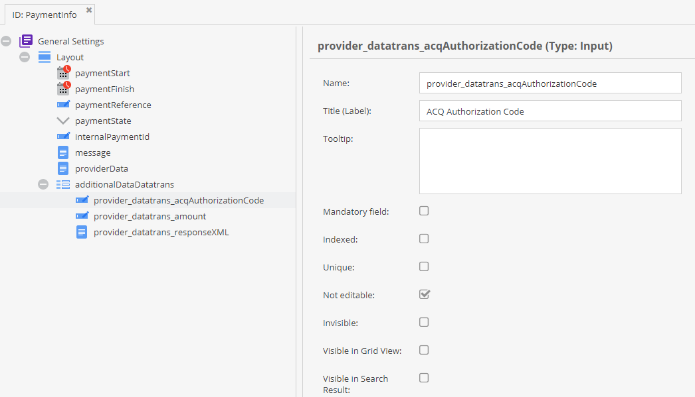

# Pimcore E-Commerce Framework Payment Provider - Datatrans

### Official Datatrans Documentation
* [Datatrans Documentation](https://www.datatrans.ch/showcase/authorisation/payment-method-selection-on-merchant-website)
* [Test card numbers](https://docs.datatrans.ch/docs/testing-credentials#section-credit-debit-cards)

## Installation

Install latest version with composer:
```bash 
composer require pimcore/payment-provider-datatrans
```

Enable bundle via console or extensions manager in Pimcore backend:
```bash
php bin/console pimcore:bundle:enable PimcorePaymentProviderDatatransBundle
php bin/console pimcore:bundle:install PimcorePaymentProviderDatatransBundle
```

## Configuration

The Payment Manager is responsible for implementation
of different Payment Provider to integrate them into the framework. 

For more information about Payment Manager, see 
[Payment Manager Docs](../13_Checkout_Manager/07_Integrating_Payment.md). 

Configure payment provider in the `pimcore_ecommerce_config.payment_manager` config section: 
```yaml
pimcore_ecommerce_config:
    payment_manager:
        providers:
            datatrans:
                # service ID of payment provider implementation
                provider_id: Pimcore\Bundle\EcommerceFrameworkBundle\PaymentManager\Payment\Datatrans

                # active profile - you can define multiple profiles in the section below 
                profile: sandbox

                # available profiles with options - options vary on the provider implementation as the
                profiles:
                    sandbox:
                        merchant_id: 1000011011
                        sign: 30916165706580013
                        use_digital_signature: false
                    live:
                        merchant_id: merchant_id_id
                        sign: sign_id
                        use_digital_signature: false
                        mode: live
```

Payment Information: Order payment section "Payment Informations" stores information about every payment trial by Customer.

Add additional fields in "PaymentInfo" fieldcollection, so that Order Manager stores information in Order object:


> It's possible to make an authorisation and clearing in one step. Default behavior is authorisation only. 
> For automatic clearing set the option "reqtype" to "CAA"

```php
<?php
$url = 'http://'. $_SERVER["HTTP_HOST"] . "/en/checkout/payment-status?mode=";
$config = [
    // checkout config
    'language' => $language
    , 'refno' => $paymentInformation->getInternalPaymentId()
    , 'useAlias' => true
    , 'reqtype' => 'CAA'    // Authorisation and settlement

    // system
    , 'successUrl' => $url . 'success'
    , 'errorUrl' => $url . 'error'
    , 'cancelUrl' => $url . 'cancel'
];
```
